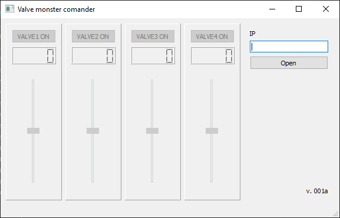

# Valve monster Comander 

**This client pats for system of controlling electro-mechanical valves**

The system Valve Monster Comander (VMC) consists of client and server parts.
Server parts based on Raspberry pi3 and development by Python language used modules:

* pymodbus
* RPi.GPIO

Client parts devlopment by Pyton language used modules:

* pymodbus
* pyqt5

Client application allows connect to server by ip address and controlled time open and close valves.

Main windows:

 

It is demonstration project for exploring some possibilities of python moduls
  

